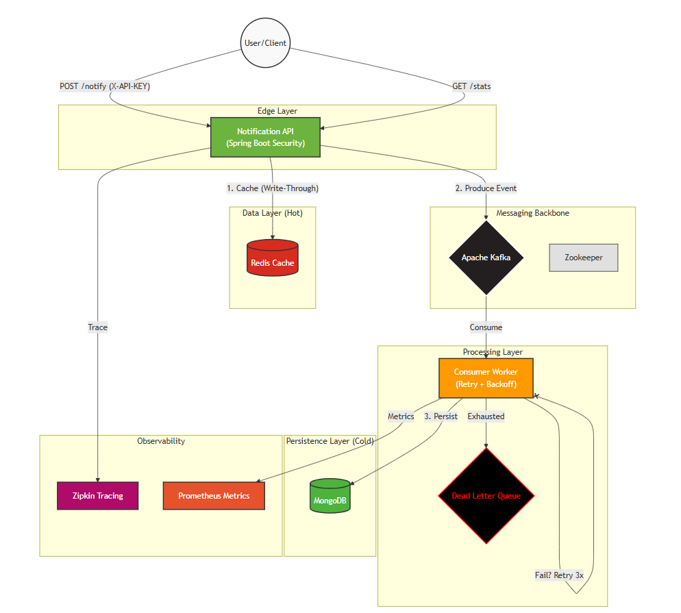

# 🌊 StreamFlow - Distributed Notification Engine


**StreamFlow** is a production-grade, fault-tolerant notification engine designed for high throughput and reliability. It uses an **Event-Driven Architecture** to decouple ingestion from processing, ensuring zero data loss even during traffic spikes.

This project demonstrates **Senior Engineering Principles** including Write-Through Caching, Circuit Breaker patterns, Distributed Tracing, and Automated CI/CD.

---

## 🏗️ System Architecture

The system splits traffic into a **Fast Read Path** (served from Redis Memory) and a **Reliable Write Path** (processed Asynchronously via Kafka).




---

## 🚀 Key Features (The "Senior Stack")

### 1. **Resilience & Fault Tolerance**

* **Circuit Breaker Strategy:** Implements `Spring Retry` with **Exponential Backoff** (1s, 2s, 4s) to handle transient failures (e.g., network blips).
* **Dead Letter Queue (DLQ):** Messages that fail after max retries are never lost; they are routed to a dedicated `notifications-dlq` topic for manual recovery.

### 2. **Performance Optimization**

* **Write-Through Caching:** New notifications are instantly cached in **Redis** while being processed asynchronously.
* **Impact:** Reduces database load and enables **< 5ms latency** for the "Recent Notifications" endpoint.

### 3. **Security & Validation**

* **API Key Authentication:** Custom Security Filter Chain (`ApiKeyAuthFilter`) protects all V1 endpoints.
* **Input Validation:** Strict DTO validation (JSR-380) ensures no bad data enters the pipeline.

### 4. **Observability & Metrics**

* **Distributed Tracing:** **Zipkin** integration visualizes the full request journey (`API -> Kafka -> Consumer -> DB`).
* **Custom Metrics:** **Micrometer** tracks business KPIs:
* `notifications.sent.total`
* `notifications.processed.total`
* `notifications.dlq.total`


### 5. **DevOps & CI/CD**

* **Testcontainers:** Integration tests spin up *real* Docker containers for Kafka and Mongo (no mocks!).
* **GitHub Actions:** Automated pipeline builds a multi-stage Docker image and pushes it to Docker Hub.

---

## 🛠️ Tech Stack

| Component | Technology |
| --- | --- |
| **Core** | Java 17, Spring Boot 3.4 |
| **Messaging** | Apache Kafka, Zookeeper |
| **Database** | MongoDB (Persistence), Redis (Caching) |
| **Security** | Spring Security, Custom Filters |
| **Testing** | JUnit 5, Testcontainers, Awaitility |
| **DevOps** | Docker Compose, GitHub Actions |
| **Monitoring** | Zipkin, Spring Actuator, Micrometer |

---

## ⚡ How to Run

### Prerequisites

* Docker Desktop installed.
* (Optional) Java 17 for local dev.

### 1. Start Infrastructure

Spin up the entire stack (Kafka, Zookeeper, Redis, Mongo, Zipkin) in one command:

```bash
docker-compose up -d

```

### 2. Run the Application

You can run the app locally against the Docker infrastructure:

```bash
cd core/core
./mvnw clean spring-boot:run

```

*The app will start on port `9090`.*

### 3. Verify It Works

Go to **Swagger UI** to interact with the secured API:
👉 **[http://localhost:9090/swagger-ui.html](https://www.google.com/search?q=http://localhost:9090/swagger-ui.html)**

> **Note:** You must authorise using the API Key defined in `application.yml` (Default: `secret-key-change-in-production`).

---

## 🧪 Testing & Validation

### Integration Tests

Run the production-grade test suite (using Testcontainers):

```bash
./mvnw clean verify

```

### API Endpoints (V1)

| Method | Endpoint | Description | Auth Required |
| --- | --- | --- | --- |
| `POST` | `/api/v1/notify` | Send async notification | ✅ Yes |
| `GET` | `/api/v1/notify/recent` | Fetch from Redis (Fast) | ✅ Yes |
| `GET` | `/api/v1/notify/history` | Paginated MongoDB history | ✅ Yes |
| `GET` | `/api/v1/notify/filter/type/{type}` | Filter by INFO/WARN/ERROR | ✅ Yes |
| `GET` | `/api/v1/notify/stats` | View system counters | ✅ Yes |

---


## 👨‍💻 Author

**Mohd Arshad**
*Backend Engineer specializing in Distributed Systems & Cloud Native Architecture.*
